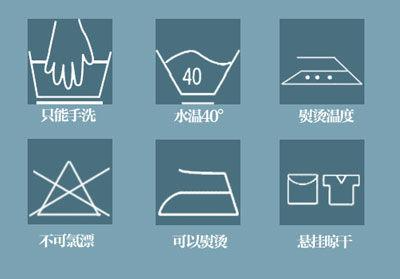

# （一）、先导知识


## 一、计算机基础知识

### 1 、计算机

**计算机**（computer）俗称电脑，是现代一种用于高速计算的电子计算机器，可以进行**数值计算**，又可以进行**逻辑计算**，还具有**存储记忆**功能。是能够按照程序运行，自动、高速处理海量数据的现代化智能电子设备。

现在的计算机被称之**冯·诺依曼式计算机**，由**运算器**、**控制器**、**存储器**、**输入设备**、**输出设备**五大部分组成。


冯·诺依曼（John von Neumann，1903年12月28日-1957年2月8日），美籍匈牙利数学家、计算机科学家、物理学家，被后人称为“现代计算机之父”、“博弈论之父”。


艾伦·图灵（Alan Mathison Turing，1912年6月23日—1954年6月7日），英国数学家、逻辑学家，被后人称为“计算机科学之父”，“人工智能之父”。

### 2 、软件和硬件

计算机系统由软件和硬件组成。

**硬件：** 硬件是看得见、摸得着的物理部件或设备。


**软件：**软件是以程序和文档的形式存在，通过在计算机上运行来体现他的作用。

+ 系统软件：各类操作系统，如windows、Linux、UNIX等。
+ 应用软件：Excel，王者荣耀，浏览器...

### 3、C/S 结构和 B/S 结构

应用软件可以有很多分类

功能可以分为：文字处理、数据管理、图像处理软件

应用程序运行的载体不同，可以分为`服务端程序`（后端）和`客户端程序`

根据设计结构不同，可以分为C/S结构和B/S结构

+ 观察一下应用软件特点
  + 
  + 
  
  


+ C/S结构：Client/Server（客户机/服务器）结构，客户端程序直接运行在操作系统上，需要安装。

  

+ B/S结构：Browser/Server（浏览器/服务器）结构，客户端程序运行在浏览器上，无需安装。

  

+ C/S和B/S区别

  


## 二、前端介绍

### 1、前端是什么


**百度百科里有这么一段解释：**

> **前端开发**是创建Web页面或app等前端界面呈现给用户的过程，通过**HTML**，**CSS**及**JavaScript**以及衍生出来的各种技术、框架、解决方案，来实现互联网产品的用户界面交互。它从网页制作演变而来，名称上有很明显的时代特征。在互联网的演化进程中，网页制作是Web1.0时代的产物，早期网站主要内容都是静态，以图片和文字为主，用户使用网站的行为也以浏览为主。随着[=互联网技术的发展和HTML5、CSS3的应用，现代网页更加美观，交互效果显著，功能更加强大。

**其实说了这么多，直接通俗一点说，前端就是利用三大核心（HTML，CSS，JavaScript）技术，以及衍生技术开发出来的主要在浏览器上展示的页面（网页）**

**前端的产物：**

1. **任何浏览器上看到的任何页面**
2. **官方网站**
3. **后台管理系统**
4. **微信小程序**
5. **公众号**
6. **HTML5 开发移动端 APP**
7. **跨平台的桌面端的应用程序**
8. **写 NodeJS 程序，部署服务器**
9. **当然还顺带要学会一点ps切图技术**

### 2、前端的发展史

+ 早期的开发模式


+ 现代的开发模式


### 3、前端课程大纲


根据岗位需求定制课程大纲：


## 三、网站的建站流程

### 1、开发流程

与前端开发工程师打交道的岗位如下：

- 产品经理 （需求经理）
- UI 设计师
- 后端开发工程师
- 测试工程师


### 2、开发项目图例

+ 网址

  `http://www.atguigu.com/`

+ 网页

  

+ 网站

  由一个或者多个网页组成的就是网站

### 3、网页的结构


### 4、WEB标准

```txt
WEB标准是网页制作的标准，它不是一个标准，它是根据网页的不同组成部分生成的一系列标准。这些标准大部分由W3C起草发布，也有部分标准由ECMA起草发布
```


```txt
（1）W3C( World Wide Web Consortium )万维网联盟，创建于1994年是Web技术领域最具权威和影响力的国际中立性技术标准机构；是专门负责网络标准制定的非赢利组织。制定了结构标准和样式标准；
（2）ECMA：欧洲电脑网商联合会（厂商协会），制定了行为标准；
```


### 5、常见浏览器

​	浏览器是网页运行的平台，常见的浏览器有` IE` 、`火狐（Firefox）`,`谷歌（Chrome）`,`Safari`和`Opera`等，我们平时称为五大浏览器，第六个是`Edge`浏览器，是微软改进IE新出的内置浏览器


+ **PC端 浏览器 市场占有率**
  + Google的Chrome浏览器排名第一，其市场份额为45.74%
  + 微软的IE浏览器排名第二，其份额为22.95%；（其中，IE9的份额为8.19%，IE8的份额为6.86%，IE11的份额为5.31%，IE7的份额为2.58%）
  + QQ浏览器排名第三，其份额为6.70%
  + 2345加速浏览器排名第四，其份额为6.06%
  + 搜狗高速浏览器排名第五，其份额为4.22%
  + 火狐浏览器排名第六，其份额为2.32%
  + 其他浏览器的市场份额合计为12.00%


+ **浏览器内核**

  - IE IE是Trident内核。Window发布后，windows10发布以后IE将其内置浏览器命名为Edge,Edge最显著的特点就是新内核。

  - Firefox(火狐) Gecko内核，Gecko的特点是代码完全公开，因此开发程度很高，全世界的程序员都可以为其编写代码，增加功能，可惜这几年没落了，比如打开速度慢，升级频繁，猪一样的队友flash，神一样的对手chrome。

  - Safari 采用的是大名鼎鼎的WebKit。 现在很多人错误的把webkit叫做chrome（即使chrome内核已经是blink，之前采用的是webkit内核）。

  - chrome(谷歌) Blink内核,在Chromium项目中研发Blink内核渲染引擎（即浏览器核心），内置于Chrome浏览器之中，Blink其实是Webkit的分支，大部分国产浏览器最新版用Blink内核。

  - Opera Presto内核(已经废弃)是挪威产浏览器opera的“前任”内核，为何说是“前任”，因为最新的opera浏览器早已抛弃投入到谷歌的怀抱了，采用Blink。

  - 其他国产浏览器，比如：猎豹、360极速浏览器、百度浏览器等，都是在国外浏览器的内核的基础上加上了自己的UI壳子，就成了自己的浏览器了。

    现在开发过程中大部分都使用chrome。做开发的90%以上都会用chrome。


# （二）、第一部分HTML

## 一、概述


### 1.1、HTML简介

```txt
HTML 指的是超文本标记语言 (Hyper Text Markup Language) www万维网的描述性语言。

XHTML指可扩展超文本标记语言（标识语言）（EXtensible HyperText Markup Language）是一种置标语言，表现方式与超文本标记语言（HTML）类似，不过语法上更加严格。

HTML5指的是HTML的第五次重大修改（第5个版本）
```


### 1.2、HTML发展

- HTML是从2.0版本开始的，实际上没有1.0的官方规范,在1993年6月作为互联网工程工作小组（IETF）工作草案发布（并非标准） HTML 2.0——1995年11月作为RFC 1866发布，在RFC 2854于2000年6月发布之后被宣布已经过时
- HTML 3.2——1997年1月14日，W3C推荐标准
- HTML 4.0——1997年12月18日，W3C推荐标准
- HTML 4.01（微小改进）——1999年12月24日，W3C推荐标准
- HTML 5——2014年10月28日，W3C推荐标准


### 1.3、编辑器

**代码编辑器**是程序员用于编写[计算机程序的文本编辑器。它通常是一个独立的应用程序，或是作为集成开发环境的一部分存在，或者是一个运行于浏览器中的网页编辑器。由于程序员的主要任务就是编写代码，因此代码编辑器也就成为了最为重要的开发工具。代码编辑器一般是带有语法高亮，关键字一看就知道，还有括号匹配也能通过不同的颜色看出来，对编写程序很有帮助。

前端常见的代码编辑器：


| 编辑器       | 下载地址                                           |
| ------------ | -------------------------------------------------- |
| WebStorm     | https://blog.jetbrains.com/webstorm/               |
| VSCode       | https://code.visualstudio.com/                     |
| HbuilderX    | https://www.dcloud.io/hbuilderx.html               |
| Sublime Text | https://www.sublimetext.com/                       |
| Atom         | https://atom.io/                                   |
| Brackets     | http://brackets.io/                                |
| NodePad++    | https://notepad-plus-plus.org/                     |
| EditPlus     | https://www.editplus.com/                          |
| Vim          | https://www.oschina.net/p/gvim                     |
| Dreamweaver  | https://www.adobe.com/cn/products/dreamweaver.html |

企业级应用最多的编译器：vscode和webstorm

**vscode的安装**

1. 双击：

   

   

2. 选择安装位置：

   

3. 默认名字即可

   

4. 其他任务要注意：

   

   ①将“通过code 打开“操作添加到windows资源管理器文件上下文菜单

   ②将“通过code 打开”操作添加到windows资源管理器目录上下文菜单

   说明：①②勾选上，可以对文件，目录点击鼠标右键，选择使用 VScode 打开。

   ③将code注册为受支持的文件类型的编辑器

   说明：默认使用 VScode 打开诸如 txt,py 等文本类型的文件，一般建议不勾选。

   让 VScode 支持的代码文件全部变成 VScode 默认打开，文件图标也会随之更改，很好辨认。

   ④添加到PATH（重启后生效）

   说明：这步骤默认的，勾选上，不用配置环境变量，可以直接使用。

5. 最后一步：

   

6. 打开编辑器：

   

**使用vscode编译器**

> 使用vscode打开html文件的时候必须要把文件存储到文件夹中，然后通过vscode打开文件夹才可以访问文件夹下的文件，不可以直接通过vscode打开文件。

使用vscode打开文件的三种方式：

+ 在文件夹上鼠标右键，打开方式选择vscode
+ 点击文件，然后点击打开文件夹
+ 拖拽文件夹到vscode

**安装vscode的插件**

+ Chinese (Simplified) Language Pack for Visual Studio Code 中文语言包

+ vscode-icons（图标插件）

+ Path Intellisense 路径的

+ open in browser  打开浏览器 （alt+b）

  

  


### 1.4、建立站点

```txt	
规划网站的所有内容和代码
整合资源
css(样式)、js(交互)、images（图片）、html（网页）
```

### 1.5 文件的命名规范

+ 小写英文字母、数字、下划线的组合，
+ 其中不得包含汉字、空格和特殊字符；
+ 必须以英文字母开头。


## 二、HTML 基本语法


### 2.1、标签的分类



+ 标签也叫做标记或者元素
+ 标签起初是指具有信息表示作用和功能
+ HTML 标签是由尖括号包围的关键词，比如**\<html>**

### 2.2、标签的组成

+ **HTML语言组成：标签和属性**

  + 标签

    + ```txt
      写在尖角号<>里的第一个单词，叫做标记，也叫做标签，也称作元素；
      ```

  + 属性

    + ```
      标记和属性用空格隔开，属性和属性值用等号连接，属性值必须放在双引号内
      一个标记可以有多个属性，属性和属性之间用空格隔开，属性不分先后顺序
      ```

+ **HTML语法**

  + 常规标记(双标记)：
    <标记名称 属性1名="属性1值" 属性2名="属性2值" ………… ></标记名>
  + 空标记（单标记）：<标记名 属性1名="属性1值" />


### 2.3、双标签

```html
<!--双标记标签
	HTML 标签通常是成对出现的，比如 <body>和 </body>，标签中的第一个标签是开始标签，第二个标签是结束标签（闭合标签）
-->
<html></html>
```

### 2.4、单标签

```html
<!--单标记标签 -->
<meta/>
<br> 或 <br/>
<hr> 或 <hr/>
```

### 2.5、 HTML标签关系

​	嵌套关系：父子和后代关系

​	并列关系：同级关系（兄弟关系）


### 2.6、HTML 标签语义化

​	**学习标签是有技巧的，重点是记住每个标签的语义。简单理解就是指标签的含义，即这个标签是用来干嘛的。 什么是语义化标签？ 根据标签的语义，在合适的地方给一个最为合理的标签，可以让页面结构更清晰。** 

下图没有语义化标签：


添加语义标签后：


## 三：HTML架构

### 3.1：HTML5基本结构


### 3.2、注释

**1. 注释标签**

1. html注释就是html中 对某一块内容的解释，但是不会被浏览器编译

2. 注释的快捷键  ctrl+/ 或者 ctrl+shift+/

3. ```html
   <!-- 年轻人，耗汁尾汁-->
   
   <!-- 苍茫的天涯是我爱，
        绵绵青山脚下花正开，
   -->
   ```

**2. 条件注释**

> 条件注释只能在IE下使用，IE5~IE9可以使用

```html
<!--[if IE 8]>
    如果你是IE8的浏览器才可以访问。
<![endif]-->
```

### 3.3、分析标准结构

##### 1、文档声明

你可使用此声明在 Internet Explorer 6 及以后版本中切换为严格的标准兼容模式。

1. ```html
   <!DOCTYPE HTML PUBLIC "-//W3C//DTD HTML 4.01//EN" "http://www.w3.org/TR/html4/strict.dtd">
   
   <!DOCTYPE html PUBLIC "-//W3C//DTD XHTML 1.0 Transitional//EN"
    "http://www.w3.org/TR/xhtml1/DTD/xhtml1-transitional.dtd">
   
   <!DOCTYPE html>
   ```

   

   + 概念：告诉浏览器当前的文档使用的HTML标准是**HTML5** ,如果不写文档声明的话，会导致浏览器进入怪异渲染模式（浏览器自己选择HTML版本进行渲染）

   + 注意：文档声明必须在HTML文档的第一行。

   + 写法：

     1. 以前：要依网页所用的HTML版本而定，写法有很多。

        具体有哪些写法请参考 ：<a href="https://www.w3.org/QA/2002/04/valid-dtd-list.html">W3C官网-文档声明</a>（了解即可，千万别背！）

     2. 如今：一切都变得简单了！**W3C** 推荐使用：最新的HTML 5的写法，写法如下

        `<!DOCTYPE html>`

        

   ##### 根元素

2. ```html
   <html lang="en"></html>
   ```

   + 根元素：一个页面只能出现一个，并且该元素是其他元素的父元素或者祖先元素.

     ​               全局属性，表示该元素内部使用的文字是使用哪一种自然语言书写而成。这样可以触发浏览器的阅读或者翻译功能

   + 扩展知识：lang属性的编写规则（了解即可）。

     1. 第一种写法（ 语言 - 国家/地区 ）例如：

        - `zh-CN`  ：中文-中国大陆
        - `zh-TW` ：中文-中国台湾
        - `en-US` ：英语-美国
        - `en-GB` ：英语-英国

     2. 第二种写法（ 语言 - 具体种类）例如：

        - `zh-hans` ：中文简体
        - `zh-hant` ：中文繁体
        - `zh` ：中文（简体+繁体） **常用**

     3. W3C-School 上的说明：

        《语言代码参考手册》         https://www.w3school.com.cn/tags/html_ref_language_codes.asp

        《国家/地区代码参考手册》https://www.w3school.com.cn/tags/html_ref_country_codes.asp 

     4. W3C官网上的说明：

        《Language tags in HTML》https://www.w3.org/International/articles/language-tags/

#####      2、网页头部

1. ```html
   <head>
       <meta charset="UTF-8">
       <title>Document</title>
   </head>
   ```

   + 头部元素：文档头内部的内容不会显示在页面上。

   + meta标签：文档的元数据（附加信息）–>告诉浏览器页面的其他信息，不是用于显示的。

     1. charset：指定网页内容编码

     2. 字符集的演变

        ```python
        '''编码集的演变---
        由于计算机是美国人发明的，因此，最早只有127个字符被编码到计算机里，也就是大小写英文字母、数字和一些符号，
        这个编码表被称为ASCII编码，比如大写字母A的编码是65，小写字母z的编码是122。
        但是要处理中文显然一个字节是不够的，至少需要两个字节，而且还不能和ASCII编码冲突，
        所以，中国制定了GB2312编码，用来把中文编进去。
        你可以想得到的是，全世界有上百种语言，日本把日文编到Shift_JIS里，韩国把韩文编到Euc-kr里，
        各国有各国的标准，就会不可避免地出现冲突，结果就是，在多语言混合的文本中，显示出来会有乱码。
        因此，Unicode应运而生。Unicode把所有语言都统一到一套编码里，这样就不会再有乱码问题了。
        Unicode标准也在不断发展，但最常用的是用两个字节表示一个字符（如果要用到非常偏僻的字符，就需要4个字节）。
        现代操作系统和大多数编程语言都直接支持Unicode。'''
        ```

     


<!DOCTYPE html PUBLIC "-//W3C//DTD XHTML 1.0 Transitional//EN"
"http://www.w3.org/TR/xhtml1/DTD/xhtml1-transitional.dtd">

## 四、HTML常用标签

### 4.1标签重点

要掌握一个 HTML 标签，我们需要记住以下几点：

- ① 标签的语义、作用。
- ② 该标签有哪些属性，属性的值是怎样的。
- ③ 该标签是单标签还是双标签。

### 4.2、主体结构标签

| 标签名 | 标签的语义、效果 | 标签属性                                         | 单还是双 |
| ------ | ---------------- | ------------------------------------------------ | -------- |
| html   | 根标签           | `lang` ：指定：语言、国家/地区，通常为：zh-CN/en | 双       |
| head   | 页面头部         |                                                  | 双       |
| meta   | 设置网页元信息   | `charset` ：指定字符集编码，建议设置为：UTF-8    | 单       |
| title  | 网页标题         |                                                  | 双       |
| body   | 页面主体         |                                                  | 双       |

### 4.3、格式排版标签

| 标签名 | 标签的语义、效果                         | 标签属性 | 单还是双 |
| ------ | ---------------------------------------- | -------- | -------- |
| h1~h6  | 标题（文字会加粗放大显示）               |          | 双       |
| p      | 段落                                     |          | 双       |
| br     | 换行（它的重点在效果）                   |          | 单       |
| hr     | 分割线                                   |          | 单       |
| pre    | 按原文显示                               |          | 双       |
| 1div   | 最常见的标签，没有任何语义，用于页面布局 |          | 双       |

+ **标题标签**

  + h1～h6 标签分别表示不同级别的标题，**\<h1>**定义最大的标题，**\<h6>**定义最小的标题
  + 在浏览器默认状态下，每种标题均为加粗效果，各自对应不同的文字大小
  + 显示效果：

  

  + 注意：（1）页面中`h1`最好写一个，`h2`等可以适当多写。

    ​            （2）`h1~h6  `不要互相嵌套，例如：`h1` 标签中不要嵌套`h2` 标签。

+ **段落标签**

  + p 标签用于定义一个段落 **\<p>\</p>**
  + `p` 标签不能嵌套，即：段落里，不能再有段落了。

+ **换行标签**

  + br标签表示换行，为单标签，通常出现在 p 标签中

  + ```html
    <p>
       桃花坞里桃花庵，桃花庵里桃花仙。<br>
       桃花仙人种桃树，又折花枝当酒钱。
    </p>
    ```

+ 面试题：br与p标签区别？

  ```html
  首先，相同之处是br和p都是有换行的属性及意思
  其次，区别<br />是只需一个单独使用，而<p>和</p>是一对使用
  再次，br标签是小换行提行，p标签是大换行（分段）各行作用（有一个空白行样式）。
  在未对p设置css样式时候，一般使用一个<p>段落标签效果等于使用两个<br />换行标签效果。
  ```

+ **分割标签**

  + **\<hr>** 标签在 HTML 页面中创建一条水平线
  + 水平分隔线（horizontal rule）可以在视觉上将文档分隔成各个部分。

+ **按原文显示**

  + **pre**按原文显示

  + 标签一般是网页内嵌入代码的时候用（文字小，效果不是很好）

  + ```html
    <pre>
         桃花坞里桃花庵，桃花庵里桃花仙.
         桃花仙人种桃树，又折花枝当酒钱.
    </pre>
    ```

+ **div标签**（重点）

  + 整体页面布局当中最重要的 HTML 元素
  + 没有任何具体的含义，主要用于网页的布局，通过一个一个的div将页面划分为不同的部分，之后在针对部分进行开发
  + 注释：\<div> 是一个块级元素，也就是说，浏览器通常会在 div 元素前后放置一个换行符。
  + 无语意标签，一般用于包裹其他标签（生活中的空气）。

### 4.4、文本标签（常用）

| 标签名 | 标签的语义、效果             | 标签属性 | 单还是双 |
| ------ | ---------------------------- | -------- | -------- |
| em     | 表示强调，斜体字             |          | 双       |
| strong | 表示强调（语气更强），粗体字 |          | 双       |
| del    | 删除的文本                   |          | 双       |
| ins    | 插入的文本                   |          | 双       |
| sub    | 下标字                       |          | 双       |
| sup    | 上标字                       |          | 双       |

注意点：

1. 格式排版标签更宏观（一大段文字）。文本标签更微观（某个词汇或短语）。
2. 通常写在排版标签里面。

```html
<!--一下文本标签  作为了解-->
<cite>    用于引证、举例、(标签定义作品（比如书籍、歌曲、电影、电视节目、绘画、雕塑等等）的标题)通常为斜体字
<dfn> 定义一个定义项目
<code> 定义计算机代码文本
<samp> 定义样式文本 标签并不经常使用。只有在要从正常的上下文中将某些短字符序列提取出来，对它们加以强调的极少情况下，才使用这个标签。
<kbd> 定义键盘文本。它表示文本是从键盘上键入的。它经常用在与计算机相关的文档或手册中。
<abbr> 定义缩写 配合title属性  (IE6以上)
<bdo>  来覆盖默认的文本方向 dir属性 值: lrt  rtl
<var> 定义变量。您可以将此标签与 <pre> 及 <code> 标签配合使用。
<small> 标签定义小型文本（和旁注）
<b>    粗体字标签 根据 HTML 5 的规范，<b> 标签应该做为最后的选择，只有在没有其他标记比较合适时才使用它。
<i>    斜体字标签 标签被用来表示科技术语、其他语种的成语俗语、想法、宇宙飞船的名字等等。
<u>    下划线字体标签 标签定义与常规文本风格不同的文本，像拼写错误的单词或者汉语中的专有名词。 请尽量避免使用 <u> 为文本加下划线，用户会把它混淆为一个超链接。
<q>  签定义一个短的引用。浏览器经常会在这种引用的周围插入引号。(小段文字)
<blockquote> 标签定义摘自另一个源的块引用。浏览器通常会对 <blockquote> 元素进行缩进。(大段文字) (块状元素)
<address>  定义地址 通常为斜体 (注意非通讯地址)  块状元素
<font>     H5已删除 字体标签，可以通过标签的属性指定文字的大小、颜色及字体等信息
<tt>       H5已删除 打字机文字
<big>      H5已删除 大型字体标签
<strike>   H5已删除 添加删除线
<acronym>  H5已删除 首字母缩写 请使用<abbr>代替
```

### 4.5: 常用转义字符

一些字符在 HTML 中是预留的，拥有特殊的含义，比如小于号 `<` 用于定义 HTML 标签的开始。如果我们希望浏览器正确地显示这些字符，我们必须在 HTML 源码中插入字符实体。

**字符实体**有三部分：一个和号`&`和一个实体名称（或者一个`#` 和一个实体编号），以及一个分号`;`。

使用实体名称而不是实体编号的好处在于，名称相对来说更容易记忆。而这么做的坏处是，并不是所有的浏览器都支持最新的实体名称，然而几乎所有的浏览器对实体编号的支持都很好。

```txt
&nbsp;     不换行空格
&gt;       >右尖括号
&lt;       <左尖括号
&copy;     备案中图标版权 ©
```


## 五、HTML功能标签

### 5.1、img标签

+ **常见图片格式**

**GIF** -- 最多支持256色,支持透明,支持多帧动画显示效果.gif

**JPEG** -- 支持多种颜色,可以有很高的压缩比,使用了有损压缩,不支持透明,不支持动画效果 .jpg

**PNG** -- 是一种新的图片技术,可以表现品质比较高的图片,使用了无损压缩,支持透明,不支持动画.png

+ **基本使用：**

```html

src 是标签的必须属性，它用于指定图像文件的路径和文件名
```

+ **属性：**

| 属性   | 属性值   | 说明                               |
| ------ | -------- | ---------------------------------- |
| src    | 图片路径 | 必须属性                           |
| alt    | 文本     | 替换文字，图片不能显示的文字       |
| title  | 文本     | 提示文本，鼠标放到图像上显示的文字 |
| width  | 像素     | 设置图像的宽度                     |
| height | 像素     | 设置图像的高度                     |
| border | 像素     | 设置图像的边框的粗细               |

+ **注意点**

1. 图像标签可以拥有多个属性，必须写在标签名的后面。
2. 属性之间不分先后顺序，标签名与属性、属性与属性之间均以空格分开。
3. 属性采取键值对的格式，即 key=“value" 的格式，属性 =“属性值”。

**路径**

+ **相对路径**

  以引用文件所在位置为参考基础，而建立出的目录路径。 这里简单来说，图片相对于 HTML 页面的位置。

  | 相对路径分类 |  符号  | 说明                                                         |
  | :----------: | :----: | :----------------------------------------------------------- |
  |  同一级路径  | 文件名 | 图像文件位于HTML文件的同一级，如       |
  |  下一级路径  |   /    | 图像文件位于HTML文件的下一级，如 |
  |  上一级路径  |  ../   | 图像文件位于HTML文件的上一级，如    |

  相对路径是从代码所在的这个文件出发，去寻找目标文件的，而我们这里所说的同一级、下一级 、上一级就是 图片相对于 HTML 页面的位置。

+ **绝对路径**

  + 本地的绝对路径`file:///C:/Users/lijingAction/Desktop/西安220314.html`
  + 网络的绝对路径`https://www.baidu.com/img/pc_cc75653cd975aea6d4ba1f59b3697455.png`

+ **路径的应用场景**

  - 使用 img 标签导入图片
  - a 标签指定链接到页面地址
  - link 标签引入 css 文件或图标文件
  - script 标签引入 js 文件


### 5.2、超链接

+ **基本格式**：

  ```html
  <a href='要跳转的地址'  target = "_black/ _self"  title = '文本提示'>超链接文字</a>
  
  属性：
  	href：   要跳转的地址，url链接源（线上网址、本地文件、Email地址。）
      target： 打开方式
  		  _black 新建打开
  		  _self  默认值，原网页打开
      title： 文本提示
  
  ```

+ **使用场景**（链接，下载，锚点）

  1. 链接地址

  ```html
  <a href="http://www.atguigu.com/">尚硅谷</a>
  <a href="西安220314.html`">西安尚硅谷</a>
  ```

  2. 下载地址

  ```html
  <a href="atguigu.zip">下载一个zip压缩文件</a>
  ```

  ```html
  <a href="atguigu.zip" download="自己起名字">下载一个zip压缩文件</a>
  download属性用来设置下载文件的名称(firefox/chrome/opera支持)
  ```

  3. 锚点（网页内部跳转，网页与网页内容部的跳转）

  + 锚点的语法

  ```html
  定义锚点
  <h1 id="1">
    我是顶端
  </h1>
  跳转锚点
  <a href="#1">回到顶端</a>
  ```

  + 百度百科案例练习

  ```html
  1.<a href="#1">公司名称</a><br>
  2.<a href="#2">公司地址</a><br>
  3.<a href="#3">了解我们</a><br><br><br><br><br><br><br><br><br><br><br><br><br><br><br><br><br><br><br><br>
  
  <h1 id="1">尚硅谷</h1><br>
  <h1 id="2">西安</h1><br>
  <h1 id="3">让天下没有难学的技术</h1><br>
  ```

+ **a标签的扩展**

  ```html
  网站链接       <a href="http://www.atguigu.com">尚硅谷</a>
  发邮件         <a href="mailto:9488121@qq.com">10086</a>
  手机电话       <a href="tel:10086">10086</a>
  短信信息       <a href="sms:10086">发短息给我</a>
  
  拓展1：
  		rel = 'nofollow';  告诉搜索引擎“不要追踪此网页上的链接”或”不要追踪此特定链接”；
  		
  		例：<a href="signin.php" rel="nofollow">用户注册</a>
  		
  		以下是经常用到nofollow的几种情况：
  	       1、不可信赖的内容
             2、付费链接
             3、按优先级别进行抓取
  ```
  
+ **特殊注意点**

  + \<a>标签的文本颜色只能自身进行设置，从父级继承不到

    ```html
    <div style="color: red;">
        <a href="#">[1]从父级继承不到红色字体</a>
    </div>
    ```

  + \<a>标签的下划线颜色跟随文本颜色进行变化

    ```html
    <a href="#" style="color: green">[2]下划线颜色与文本同色</a>
    ```

  + \<a>标签不可嵌套\<a>标签

    ```html
    <a href="#">前面<a href="#">[3]a标签不可嵌套</a></a>
    ```

### 5.3、列表

​	列表就是用来布局的,列表最大的特点就是整齐、整洁、有序，它作为布局会更加自由和方便。 根据使用情景不同，列表可以分为三大类：**无序列表、有序列表、和自定义列表**。

​		（1） 无序列表


```txt	
 无序列表
    <ul>
          <li>列表项内容</li>
          <li>列表项内容</li>
          <li>列表项内容</li>
			   ........   
    </ul>
```

​		（2）有序列表


```txt
有序列表
    <ol>
          <li>列表项内容</li>
          <li>列表项内容</li>
          <li>列表项内容</li>
			   ........   
    </ol>
```

（3）自定义列表


```txt	
自定义列表
    <dl>
		<dt></dt>
		<dd></dd>
	</dl>
```

 

+ **列表总结**

  | 标签名    | 定义       | 说明                                                         |
  | --------- | ---------- | ------------------------------------------------------------ |
  | <ul></ul> | 无序列表   | 里面只能包含li，没有顺序，使用较多。    li里面可以包含任何标签。 |
  | <ol></ol> | 有序列表   | 里面只能包含li，有顺序，使用相对较少。li里面可以包含任何标签。 |
  | <dl></dl> | 自定义列表 | 里面只能包含dt和dd，dt和dd里面可以放任何标签。               |


### 5.4、表格

**1、表格的作用：**

表格主要用于显示、展示数据，因为它可以让数据显示的非常的规整，可读性非常好。特别是后台展示数据的时候，能够熟练运用表格就显得很重要。一个清爽简约的表格能够把繁杂的数据表现得很有条理。


**1 : 表格基本结构**

```html
<table>
  	<caption>表格名字</caption>
    <tr>
        <th>单元格内的文字</th>
        ...
    </tr>
     <tr>
        <td单元格内的文字</td>
        ...
    </tr>
    ...
</table>
<!-- 
	table 为表格
	caption 表格的标题
	tr  行
	th  标题列 （第一行的标题内容）
	td  内容列 （每一个单元格）
-->
```

1.一般表头单元格位于表格的第一行或第一列，表头单元格里面的文本内容加粗居中显示. 标签表示 HTML 表格的表头部分(table head 的缩写)

2.表头单元格也是单元格，常用于表格第一行突出重要性，表头单元格里面的文字会加粗居中


**2、表格属性**：

> 表格属性： 表格标签这部分属性我们实际开发我们不常用，后面通过 CSS 来设置。

| 属性名      | 属性值               | 描述                                           |
| ----------- | -------------------- | ---------------------------------------------- |
| width       | 像素值               | 设置表格的宽度               （建议用css设置） |
| height      | 像素值               | 设置表格的高度               （建议用css设置） |
| border      | 1或者""              | 设置表格的边框               （建议用css设置） |
| align       | left   center  right | 对齐方式 left/right/center（建议用css设置）    |
| cellspacing | 像素值               | 设置单元格之间的间隙    （建议用css设置）      |
| cellpadding | 像素值               | 设置单元格内边距            （建议用CSS设置）  |

+ **表格结构标签**

  [股票网站](https://stock.eastmoney.com/)

  

  **使用场景**:

   	为了让大表格(table)在下载的时候可以分段的显示,就是说在浏览器解析HTML时，table是作为一个整体解释的，使用TBODY可以优化显示。如果表格很长，用tbody分段，可以一部分一部分地显示，不用等整个表格都下载完成。 

  在表格标签中，分别用：

  ​	`<thead>`用于定义表格的头部。<thead> 内部必须拥有 <tr> 标签。 一般是位于第一行。

  ​	`<tbody>`用于定义表格的主体，主要用于放数据本体 。

  ​	`<tfoot>` 用于表格底部的内容，一般用于总计，可以没有。

  **案例练习**

  

  

  

**3、合并单元格**

  特殊情况下,可以把多个单元格合并为一个单元格。

  + rowspan="合并单元格的个数"，最上侧单元格为目标单元格, 写合并代码
  + colspan="合并单元格的个数"， 最左侧单元格为目标单元格, 写合并代码

  案例练习1：

  案例练习1：

  

  ```html
  <!DOCTYPE html>
  <html>
  	<head>
  		<meta charset="utf-8">
  		<title></title>
  	</head>
  	<body>
  		<table border="1" cellspacing="0">
  			<tr>
  				<th height="40" colspan="5" bgcolor="skyblue">个&ensp;人&ensp;简&ensp;历</th>
  		
  			</tr>
  			<tr align="center">
  				<td width="105" height="35">姓&emsp;&emsp;名：</td>
  				<td width="122"></td>
  				<td width="90">性&emsp;&emsp;别：</td>
  				<td width="142"></td>
  				<td width="130" rowspan="4">照片</td>
  			</tr>
  			<tr align="center">
  				<td height="35">婚姻状况：</td>
  				<td></td>
  				<td>出生年月：</td>
  				<td></td>
  			</tr>
  			<tr align="center">
  				<td height="35">民&emsp;&emsp;族：</td>
  				<td></td>
  				<td>政治面貌：</td>
  				<td></td>
  			</tr>
  			<tr align="center">
  				<td height="35">身&emsp;&emsp;高：</td>
  				<td></td>
  				<td>学&emsp;&emsp;历：</td>
  				<td></td>
  			</tr>
  		</table>
  	</body>
  </html>
  ```

  案例练习2：

  

  + **表格总结**

    + 表格的相关标签：table thead tbody head body tr th td
    + 表格的相关属性：cellspacing cellpadding width height border
    + 合并单元格：rowspan collspan

    

    ------
    
    
### 5.5、表单标签

   

+ **什么是表单？**

  网页中，我们需要跟用户进行交互，收集用户资料，此时就需要用到表单。使用表单的目的就是为了收集用户信息。一般用于注册和登陆页面的设计。


+ **表单的组成**

  在HTML中，一个完整的表单通常由表单元素(也称为表单控件)、提示信息和表单域3个部分构成。

  + 表单域

    表单域相当于一个容器，用来容纳所有的表单元素和提示信息

  + 提示信息

    一个表单中通常还需要包含一些说明性的文字，提示用户进行填写和操作。

  + 表单元素也叫做表单控件

    包含了具体的表单功能项，如单行文本输入框、密码输入框、复选框、提交按钮、重置按钮等。

  

+ **表单标签**

  ```html
  <form action="url地址" method="提交方式" name="表单域名称">
      各种表单元素控件
  </form>
  ```

  | 属性   | 属性值               | 作用                                                   |
  | ------ | -------------------- | ------------------------------------------------------ |
  | url    | 地址                 | 用于指定接受并处理表单数据的服务器程序的url地址        |
  | method | get/post请求方式     | 用于设置表单的提交方式                                 |
  | name   | 表单名称（使用不多） | 用于指定表单的名称，以便于区分同一个页面的不同的表单域 |

+ **表单元素**

  + `<input>` 表单元素

    表单元素中 `<input>` 标签用于收集用户信息。在 `<input>` 标签中，包含一个 type 属性，根据不同的 type 属性值，输入字段拥有很多种形式（可以是文本字段、复选框、掩码后的文本控件、单选按钮、按钮等）。

    `<input type="属性值" />`

    `<input />` 标签为单标签 type 属性设置不同的属性值用来指定不同的控件类型

  | 属性值   | 案例                                                         | 描述                                   |
  | -------- | ------------------------------------------------------------ | -------------------------------------- |
  | text     | <input type="text" value="默认值"/>                          | 定义表单输入字段，输入文本，默认宽度20 |
  | password | <input type="password" />                                    | 定义密码字段，该密码被隐藏             |
  | button   | <input type="button" value="按钮内容" />                     | 定义可以点击的按钮                     |
  | submit   | <input type="submit" value="按钮内容" />                     | 定义提交按钮，将表单数据提交给服务器   |
  | reset    | <input type="reset" value="按钮内容" />                      | 定义重置按钮，将表单数据清空           |
  | radio    | <input type="radio" name="gender" />男                                         <input type="radio" name="gender" />女 | 定义单选框                             |
  | checkbox | <input type="checkbox" name="" />                                      <input type="checkbox" name="" /> | 定义复选框                             |
  | file     | <input type="file">                                          | 上传文件                               |
  | hidden   | <input type="hidden" value="订单编号" />                     | 定义隐藏域                             |
  | image    | <input type="image" src="1.jpg" alt="文字">                  | 定义图像形式的按钮                     |

  ​	除 type 属性外，`<input>`标签还有其他很多属性，其常用属性如下：

  | 属性      | 属性值     | 描述                           |
  | --------- | ---------- | ------------------------------ |
  | name      | 用户自定义 | 定义input元素的名称            |
  | value     | 用户自定义 | 定义input元素的值              |
  | checked   | checked    | 规定元素在首次加载中应该被选中 |
  | maxlength | 正整数     | 输入字段的字符串的最大长度     |

  + `<input>`表单元素扩展

    `label>` 标签 `<label>` 标签为 input 元素定义标注（标签）。

     `<label>`标签用于绑定一个表单元素, 当点击`<label>` 标签内的文本时，浏览器就会自动将焦点(光标)转到或者选择对应的表单元素上,用来增加用户体验.

    写法1：

    ```html
    <label for="sex">男</label>
    <input type="radio" name="sex" id="sex" />
    ```

    `<label>` 标签的 for 属性应当与相关元素的 id 属性相同。

    写法2：

    ```html
    <label>
    	男：
    	<input type="radio">
    </label>
    ```

  + `<select>` 表单元素

    使用场景: 在页面中，如果有多个选项让用户选择，并且想要节约页面空间时，

    我们可以使用`<select>`标签控件定义下拉列表。`<option>`标签来定义下拉列表中的每一项。

    

    语法：

    ```html
    <select>
       <option>选项1</option>
       <option>选项2</option>
       <option>选项3</option>
       ...
    </select>
    ```

    - `<select>`标签：定义一个下拉列表。
      - name属性：定义下拉列表的名字。
      - disabled属性：禁用下拉列表。
    - `<option>`标签：定义下拉列表中的每一项。
      - value属性：传递给服务器的值。
      - disabled属性：禁用该项。不允许选择。

  + `<textarea>` 表单元素

    1. 使用场景: 当用户输入内容较多的情况下，我们就不能使用文本框表单了，此时我们可以使用 `<textarea>` 标签。
    2. 在表单元素中，`<textarea>` 标签是用于定义多行文本输入的控件。
    3. 使用多行文本输入控件，可以输入更多的文字，该控件常见于留言板，评论。

    语法：

    ```html
    <textarea rows="3" cols="20">文本内容</textarea>
    ```

    通过`<textarea>` 标签可以轻松地创建多行文本输入框。cols=“每行中的字符数” ，rows=“显示的行数”，

    我们在实际开发中不会使用太多，大多是用 CSS 来改变大小。

  + `<button>`标签也可以用来表示一个按钮，也可以提交表单

    - type属性：表示按钮的类型：值可以是button，submit、reset。

  + `扩展fieldset和legend标签`

    + fieldset：定位围绕表单的边框
    + legend：为 fieldset 定义标题

    ```html
    <!doctype html>
    <html>
    	<head>
    		<meta charset="utf-8">
    		<title>表单</title>
    	</head>
    	<body>
    		<h1>表单</h1>
    		<hr>
    		<form>
    			<fieldset>
    				<legend>注册</legend>
    				
    				<label for="nameInput">姓名：</label>
    				<input type="text" id="nameInput">
    				<br>
    				
    				<label for="pwdInput">密码：</label>
    				<input type="password" id="pwdInput">
    				<br>
    				
    				性别：
    				<label>
    					<input type="radio" name="sex">男
    				</label>
    				<label>
    					<input type="radio" name="sex">女
    				</label>
    				<label>
    					<input type="radio" name="sex">其他
    				</label>
    				<br>
    				
    				<label for="msg">留言：</label>
    				<textarea rows="8" cols="40" id="msg"></textarea>
    				<br>
    				
    				<label for="jg">籍贯：</label>
    				<select name="from" id="jg">
    					<option value="新">新疆维吾尔族自治区</option>
    					<option value="蒙">内蒙古自治区</option>
    					<option value="藏">西藏自治区</option>
    					<option value="宁" selected>宁夏回族自治区</option>
    					<option value="桂">广西壮族自治区</option>
    				</select>		
    			</fieldset>
    		</form>
    	</body>
    </html>
    ```

  + 

    


### 5.6、框架标签

  iframe 元素会创建包含另外一个文档的内联框架(即行内框架).

   https://www.gobaidugle.com/

  + **基本使用**

    ```html
    <iframe>
    </iframe>
    ```

  + **ifame嵌套网页**

    ```html
    <iframe src="http://www.taobao.com"></iframe>
    ```

  + **iframe的属性**

    | 属性名      | 属性值                                             |
    | ----------- | -------------------------------------------------- |
    | src         | 内框架的地址，可以使页面地址，也可以是图片的地址。 |
    | frameborder | 是否显示边框，1(yes),0(no)                         |
    | height      | 框架作为一个普通元素的高度，建议在使用css设置。    |
    | width       | 框架作为一个普通元素的宽度，建议使用css设置。      |
    | scrolling   | 框架的是否滚动。yes,no,auto。                      |

  + **iframe引入广告地址**

    ```html
    <iframe src="https://pos.baidu.com/ccqm?conwid=300&conhei=250&rdid=5841072&dc=3&exps=110261,110254,110011&psi=3258852170225e4989d40d519d8b742a&di=u5841072&dri=0&dis=0&dai=11&ps=2504x974&enu=encoding&ant=0&dcb=___adblockplus_&dtm=HTML_POST&dvi=0.0&dci=-1&dpt=none&tsr=0&tpr=1607149227398&ti=%E7%BD%91%E6%98%93%E6%96%B0%E9%97%BB&ari=2&ver=1203&dbv=2&drs=3&pcs=1349x657&pss=1349x12669&cfv=0&cpl=3&chi=5&cce=true&cec=GBK&tlm=1607149141&prot=2&rw=657&ltu=https%3A%2F%2Fnews.163.com%2F&ecd=1&uc=1366x728&pis=-1x-1&sr=1366x768&tcn=1607149229&qn=6259fe0d01e126a3&tt=1607149229303.44.44.44" width="300" height="250" frameborder="0"></iframe>
    ```

  + **iframe引入其他文件**

    ```html
    <iframe src="../02-表单/02-表单控件.html" width="1000"></iframe>
    ```

  + **iframe引入其他图片**

    ```html
    <iframe src="https://timgsa.baidu.com/timg?image&quality=80&size=b9999_10000&sec=1607159809041&di=59522e266c4472c45eb6ba2d238c5624&imgtype=0&src=http%3A%2F%2Fpic31.nipic.com%2F20130720%2F11030706_103335594159_2.jpg"></iframe>
    ```

  + **iframe指定a标签打开的位置**

    ```html
    <!doctype html>
    <html>
    	<head>
    		<meta charset="utf-8">
    		<title>iframe</title>
    	</head>
    	<body>
    		<a href="http://www.atguigu.com" target="atguigu">尚硅谷</a>
    		<br>	
    		<hr>
          <iframe name="atguigu" width="100%" height="600"></iframe>
    	</body>
    </html>
    ```

  + **iframe指定提交表单的位置**

    ```html
    <!doctype html>
    <html>
    	<head>
    		<meta charset="utf-8">
    		<title>iframe</title>
    	</head>
    	<body>
    		<form action="http://www.baidu.com/s" target="atguigu">
    			<input type="text" name="wd">
    			<button>搜素</button>
    		</form>
    		<hr>
    		<iframe name="atguigu" width="100%" height="600"></iframe>
    	
    	</body>
    </html>
    ```

  ## 六、HTML 全局属性

| 属性名 | 含义                                                         |
| ------ | ------------------------------------------------------------ |
| class  | class 规定元素的一个或多个类名（引用样式表中的类）class 属性不能在以下 HTML 元素中使用：base, head, html, meta, param, script, style 以及 title。 |
| id     | 规定元素的唯一 id。                                          |
| dir    | 规定元素中内容的文本方向。注意：dir 属性在以下标签中无效：base, br, frame, frameset, hr, iframe, param 以及 script。 |
| style  | 规定元素的行内 CSS 样式。                                    |
| title  | 规定有关元素的额外信息。                                     |
| lang   | 规定元素内容的语言，值是语言代码，如 cn、zh。注意：lang 属性在以下标签中无效：base, br, frame, frameset, hr, iframe, param 以及 script。 |

  ## 七、Meta 元信息

  我们可以使用 `<meta>` 标签定义 HTML 页面的元信息。

  #### 7.1、Meta 标签属性的使用

  - content 属性定义与 http-equiv 属性或 name 属性相关的元信息。

  - name 属性把 content 属性关联到一个名称。

    > name 属性常见的值：
    >
    > author
    >
    > description
    >
    > keywords
    >
    > generator
    >
    > revised
    >
    > robots
    >
    > others

  - http-equiv 把 content 属性关联到 HTTP 头部信息。

    > http-equiv 属性常见的值：
    >
    > content-type expires refresh set-cookie

  - charset 属性定义字符集编码。

    > 常见字符集编码：
    >
    > GB2312
    >
    > GBK
    >
    > UTF8

  #### 7.2、案例

  ```html
  编码字符集
  <meta charset="utf-8">  HTML5 支持 HTML5向下兼容
  <meta http-equiv="content-type" content="text/html;charset=utf-8" /> HTML 4支持
  
  网页关键字：
  <meta name="keywords" content="8-12个以英文逗号隔开的单词/词语">
  
  网页描述信息
  <meta name="description" content="80字以内的一段话，与网站内容相关">
  
  所有搜索引擎，抓取这个页面、爬行链接、禁止快照：  
  <meta name="robots" content="index,follow,noarchive">
    all：文件将被检索，且页面上的链接可以被查询；
    none：文件将不被检索，且页面上的链接不可以被查询；
    index：文件将被检索；
    follow：页面上的链接可以被查询；
    noindex：文件将不被检索，但页面上的链接可以被查询；
    nofollow：文件将被检索，但页面上的链接不可以被查询；
    noarchive：文件将被检索，但禁止保存快照；
  
  网页作者：
  <meta name="author" content="obama">
  
  网页网页生成工具 
  <meta name="generator" content="Sublime Text3">
  
  定义页面最新版本 
  <meta name="revised" content="David, 2008/8/8/" />
  
  网页版权信息：
  <meta name="copyright" content="2009-2014©版权所有">
  
  网页刷新信息：(10秒后跳转到百度页面)
  <meta http-equiv="refresh" content="10;url=http://www.baidu.com">
  ```

  

  

 

