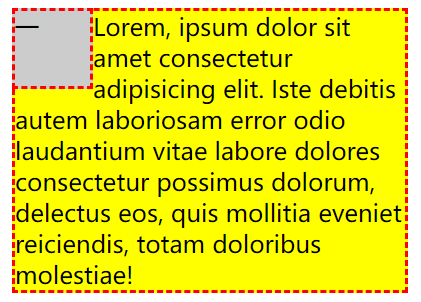
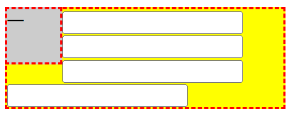
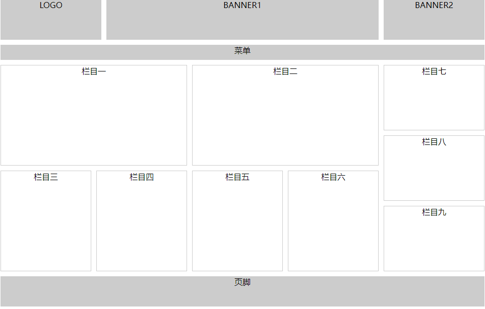

## 一、浮动前提

### 1、传统网页布局的三种方式

 CSS 提供了三种传统网页布局方式(简单说,就是盒子如何进行排列顺序)：

- 普通流（标准流/文档流）

- 浮动

- 定位

  这三种布局方式都是用来摆放盒子的，盒子摆放到合适位置，布局自然就完成了。

注意：实际开发中，一个页面基本都包含了这三种布局方式（后面移动端学习新的布局方式） 。

### 2、标准流

所谓的标准流也叫做普通流/文档流。

指HTML中元素在计算布局、排版的过程中的机制。文档源代码书写时有正常的顺序，是从上到下从左到右的。解释代码的时候也是从上到下、从左到右来解释，如果是行内元素就在一行、如果是块状元素就会自己独占一行。

1. 块级元素会独占一行，从上向下顺序排列。常用元素：div、hr、p、h1~h6、ul、ol、dl、form、table
2. 行内元素会按照顺序，从左到右顺序排列，碰到父元素边缘则自动换行。常用元素：span、a、i、em 等

以上都是标准流布局，我们前面学习的就是标准流，标准流是最基本的布局方式。

```html
<!DOCTYPE html>
<html>
	<head>
		<meta charset="utf-8">
		<title></title>
		<style type="text/css">
			div{
				display: inline-block;
				width: 200px;
				height: 200px;
				border: 1px solid red;
			}
		</style>
	</head>
	<body>
		<div>1</div>
		<div>2</div>
		<div>3</div>
	</body>
</html>

```

### 3、为什么需要浮动

+ 以前的布局

  浮动设计的最初想法是为了实现文字环绕图片的效果。

  

  后来浮动代替表格布局成为了主流的布局方式。

+ 现在的布局

  有很多的布局效果，标准流没有办法完成，此时就可以利用浮动完成布局。 因为浮动可以改变元素标签默认的排列方式.

   浮动最典型的应用：可以让多个块级元素一行内排列显示。

   网页布局第一准则：**多个块级元素纵向排列找标准流，多个块级元素横向排列找浮动**。

## 二、浮动基础

### 1、浮动的基本使用

float 属性用于创建浮动框，将其移动到一边，直到左边缘或右边缘触及包含块或另一个浮动框的边缘。

#### 1.1、基本语法

```css
 选择器 { float: 属性值; }
```

| 属性值 | 描述               |
| ------ | ------------------ |
| none   | 元素不浮动（默认） |
| left   | 元素向左浮动       |
| right  | 元素向右浮动       |

```html
<!DOCTYPE html>
<html lang="en">
<head>
    <meta charset="UTF-8">
    <title>Document</title>
    <style>
		.box{
			width: 200px;
			height: 200px;
			background-color: aqua;
			border: black solid 1px;
			float: right;
		}
    </style>
</head>
<body>
    
    <div class="box">
        
    </div>
</body>
</html>
```

#### 1.2、案例练习

+ 解决行内块空白问题

  ```html
  <!DOCTYPE html>
  <html>
  	<head>
  		<meta charset="utf-8">
  		<title></title>
  		<style type="text/css">
  			div{
  				float: left;
  				width: 200px;
  				height: 200px;
  				border: 1px solid red;
  			}
  		</style>
  	</head>
  	<body>
  		<div>1</div>
  		<div>2</div>
  		<div>3</div>
  	</body>
  </html>

  ```


+ 文字环绕图片

  浮动元素不会盖住文字，文字会自动环绕在浮动元素的周围，所以我们可以利用浮动来设置文字环绕图片的效果。

  ```css
  <!DOCTYPE html>
  <html lang="en">
  <head>
      <meta charset="UTF-8">
      <title>Document</title>
      <style>
          .box {
              padding: 20px;
              width: 600px;
              border: 2px solid #999;
          }
          .box img {
              /* 设置浮动 */
              float: right;
              margin-right: 10px;
          }
      </style>
  </head>
  <body>
      <div class="box">
          
          12月10日，国人的目光再一次被“技术工人”所吸引，新中国成立以来规格最高、项目最多、规模最大、水平最高的综合性国家职业技能赛事——中华人民共和国第一届职业技能大赛在广东省广州市开幕。
  首届全国职业技能大赛以“新时代 新技能 新梦想”为主题，设86个比赛项目，2500多名能工巧匠同场竞技。
  习近平总书记发来贺信向大赛的举办表示热烈的祝贺，向参赛选手和广大技能人才致以诚挚的问候。在贺信中，总书记明确提出要“激励更多劳动者特别是青年一代走技能成才、技能报国之路”。
      </div>
  </body>
  </html>
  ```

+ 文字环绕单词

  ```css
  <!DOCTYPE html>
  <html lang="en">
  <head>
      <meta charset="UTF-8">
      <title>Document</title>
      <style>
          p {
              width: 400px;
          }
          p span {
              font-size: 40px;
              font-weight: bold;
              float: left;
              margin-right: 20px;
          }
      </style>
  </head>
  <body>
      <p>
          <span>L</span>orem ipsum dolor sit amet consectetur adipisicing elit. Accusamus ducimus dolorem vitae error, quis at saepe blanditiis, est, ut minima natus! Vel accusamus nemo pariatur, culpa similique perspiciatis exercitationem nam?
      </p>
  </body>
  </html>
  ```

### 2、浮动的特点

### 一、所有盒子浮动：

####  1、块元素水平排列：

​		 脱离文档流，不占位 ：改变块元素的排列方式，垂直排列变成水平排列

浮动的元素会一行内显示并且元素顶部对齐


```html
<!DOCTYPE html>
<html lang="en">
<head>
    <meta charset="UTF-8">
    <title>Document</title>
    <style>
        .wrapper {
            width: 800px;
        }
        .box {
		   margin: 10px;
            width: 200px;
            height:100px;
            border: 2px dashed red;
            background-color: #ccc;
        }

        .box01 {
            float: left;
        }
        .box02 {
            float: left;
        }
        .box03 {
            float: left;
        }

    </style>
</head>
<body>
    <div class="wrapper">
        <div class="box box01">一</div>
        <div class="box box02">二</div>
        <div class="box box03">三</div>
    </div>
</body>
</html>
```

注意：

 浮动的元素是互相贴靠在一起的（不会有缝隙），如果父级宽度装不下这些浮动的盒子，多出的盒子会另起一行对齐。

#### 2、紧贴性，行内，行内块元素间隙取消：

​	浮动脱离文档流，行内块元素的特性，行内元素可以设置宽高，可以设置4个方向margin和padding

```
<!DOCTYPE html>
<html lang="en">
  <head>
    <meta charset="UTF-8" />
    <title>Document</title>
    <style>
      .wrapper {
        width: 800px;
      }
      .box {
        width: 200px;
        height: 100px;
        border: 2px dashed red;
        background-color: #ccc;
      }

      .box01 {
        float: left;
       /* 浮动特性：
				添加了浮动的元素具有行内块的特性，对行内元素来说，
				此时宽高是生效的。*/
      }
      .box02 {
        float: left;
      }
      .box03 {
        float: left;
      }
    </style>
  </head>
  <body>
    <div class="wrapper">
      <span class="box box01">一</span>
      <span class="box box02">二</span>
      <span class="box box03">三</span>
    </div>
  </body>
</html>
```

#### 3、左右顺序问题

+ 文档中的前面的元素向左浮动，那么后面的浮动元素的左边界在前一个元素右外边界的右侧
+ 文档中的前面的元素向右浮动，那么后面的浮动元素的右边界在前一个元素左外边界的左侧

```
<!DOCTYPE html>
<html>
	<head>
		<meta charset="utf-8">
		<title></title>
		<style type="text/css">
			div{
				float: left;
				width: 200px;
				height: 200px;
				border: 1px solid red;
			}
		</style>
	</head>
	<body>
		<div>1</div>
		<div>2</div>
		<div>3</div>
	</body>
</html>
```

#### 4、浮动后外边距不合并

浮动元素四周的外边距不会合并

```
<!DOCTYPE html>
<html>
	<head>
		<meta charset="utf-8">
		<title></title>
		<style type="text/css">
			.box {
				width: 200px;
				height: 300px;
				border: 1px solid red;
			}

			.box>div {
				float: left; 
				width: 100px;
				height: 50px;
				background-color: #FFC0CB;
			}

			.mb {
				margin-bottom: 25px;
			}

			.mt {
				margin-top: 25px;
			}
		</style>
	</head>
	<body>
		<div class="box">
			<div class="mb">1</div>
			<div class="mb">2</div>
			<div class="mt">3</div>
			<div class="mt">4</div>
		</div>
	</body>
</html>
```

#### 5、浮动受父元素范围限制

浮动受父元素范围限制，不规则浮动，新起一行的元素的上边界，不能超过前一个浮动元素的下边界。

```
<!DOCTYPE html>
<html>
	<head>
		<meta charset="utf-8">
		<title></title>
		<style type="text/css">
			.box{
				width: 200px;
				height: 400px;
				border:1px solid red;
			}
			.box>div{
				float: left;
				width: 100px;
				height: 100px;
				background-color: #00FFFF;
			}
			.box .c2{
				height:140px;
			}
		</style>
	</head>
	<body>
		<div class="box">
			<div>1</div>
			<div class="c2">2</div>
			<div>3</div>
		</div>
	</body>
</html>
```


### 二、单独元素浮动


#### 2.1、脱离文档流，盒子重叠（文字、文本、图片不重叠）

浮动元素会脱离标准流(脱标：浮动的盒子不再保留原先的位置)


图1，盒子2浮动，脱离文档流跟3重叠

```html
<!DOCTYPE html>
<html lang="en">
  <head>
    <meta charset="UTF-8" />
    <title>Document</title>
    <style>
      .wrapper {
        width: 500px;
        height: 300px;
        border: 4px solid #000;
      }
      .box {
        border: 2px dashed red;
        background-color: #ccc;
      }
      .box01 {
        width: 50px;
        height: 50px;
      }
      .box02 {
        width: 60px;
        height: 60px;
        float: left;
        background-color: yellow;
      }
      .box03 {
        width: 100px;
        height: 100px;
        background-color: green;
      }
    </style>
  </head>
  <body>
    <div class="wrapper1">
      <div class="box box01">一</div>
      <div class="box box02">二</div>
      <div class="box box03">三</div>
    </div>
  </body>
</html>
```

盒子1浮动跟 文本不重叠




```
<!DOCTYPE html>
<html lang="en">
  <head>
    <meta charset="UTF-8" />
    <title>Document</title>
    <style>
      .wrapper {
        width: 500px;
        height: 300px;
        border: 4px solid #000;
      }
      .box {
        border: 2px dashed red;
        background-color: #ccc;
      }
      .box01 {
        width: 50px;
        height: 50px;
        float: left;
      }
      .box02 {
        width: 260px;
        background-color: yellow;
      }
    </style>
  </head>
  <body>
    <div class="wrapper1">
      <div class="box box01">一</div>
      <div class="box box02">
        Lorem, ipsum dolor sit amet consectetur adipisicing elit. Iste debitis
        autem laboriosam error odio laudantium vitae labore dolores consectetur
        possimus dolorum, delectus eos, quis mollitia eveniet reiciendis, totam
        doloribus molestiae!
      </div>
    </div>
  </body>
</html>
```

盒子1浮动跟 表单不重叠



```
<!DOCTYPE html>
<html lang="en">
  <head>
    <meta charset="UTF-8" />
    <title>Document</title>
    <style>
      .wrapper {
        width: 500px;
        height: 300px;
        border: 4px solid #000;
      }
      .box {
        border: 2px dashed red;
        background-color: #ccc;
      }
      .box01 {
        width: 50px;
        height: 50px;
        float: left;
      }
      .box02 {
        width: 260px;
        background-color: yellow;
      }
    </style>
  </head>
  <body>
    <div class="wrapper1">
      <div class="box box01">一</div>
      <form class="box box02">
        <input type="text" />
        <input type="text" />
        <input type="text" />
        <input type="text" />
      </form>
    </div>
  </body>
</html>

```


#### 

#### 2.2、总结

1、浮动元素会完全脱离文档流，不再占据文档流中的位置,浮动可以让块元素水平排列

2、设置浮动以后元素会向父元素的左侧或右侧移动

3、元素浮动后会紧贴显示，可以取消行内，行内块的间隙

4、浮动元素具有行内块特性，内联元素浮动后，可以设置宽高和4个方向margin和padding

5、浮动元素受父元素范围的限制，超出会换行显示，margin不会重叠

简单总结： 浮动目前来讲它的主要作用就是让页面中的元素可以水平排列， 通过浮动可以制作一些水平方向的布局

### 3、浮动效果

+ 当把框 1 向右浮动时，它脱离文档流并且向右移动，直到它的右边缘碰到包含框的右边缘：

  

+ 当框 1 向左浮动时，它脱离文档流并且向左移动，直到它的左边缘碰到包含框的左边缘。因为它不再处于文档流中，所以它不占据空间，实际上覆盖住了框 2，使框 2 从视图中消失。

  

+ 如果把所有三个框都向左移动，那么框 1 向左浮动直到碰到包含框，另外两个框向左浮动直到碰到前一个浮动框。

  

+ 如果包含框太窄，无法容纳水平排列的三个浮动元素，那么其它浮动块向下移动，直到有足够的空间。

  

+ 如果浮动元素的高度不同，那么当它们向下移动时可能被其它浮动元素“卡住”：

  

### 4、清除浮动

单独元素浮动后，后面的同级盒子受浮动拖标不占位，会出现盒子重叠的效果，可以用清除浮动clear属性解决

- clear： 可以清除盒子浮动后不占位的副作用（给受影响的盒子设置）
- ​     left   清除左浮动
- ​    right  清除右浮动
- ​    both   清除两边浮动


```	
<!DOCTYPE html>
<html lang="en">
  <head>
    <meta charset="UTF-8" />
    <title>Document</title>
    <style>
      .wrapper {
        width: 500px;
        height: 300px;
        border: 4px solid #000;
      }
      .box {
        border: 2px dashed red;
        background-color: #ccc;
      }
      .box01 {
        width: 50px;
        height: 50px;
      }
      .box02 {
        width: 60px;
        height: 60px;
        float: left;
        background-color: yellow;
      }
      .box03 {
        width: 100px;
        height: 100px;
        background-color: green;
        clear: both;
        /* 往上清除浮动 清除两边浮动 */
      }
    </style>
  </head>
  <body>
    <div class="wrapper1">
      <div class="box box01">一</div>
      <div class="box box02">二</div>
      <div class="box box03">三</div>
    </div>
  </body>
</html>
```


​     

### 5、高度塌陷

子元素浮动将会导致父元素高度塌陷

```		
<!DOCTYPE html>
<html>
	<head>
		<meta charset="utf-8">
		<title></title>
		<style type="text/css">
			/* 
				浮动的盒子会导致父盒子高度塌陷：
				在不给父盒子设置高度的情况下，
				父盒子的高度不会由浮动的子盒子撑开。
			 */
			.box{
				border: 5px solid red;
				/* height: 100px; */
			}
			.box>div {
				float: left;
				width: 100px;
				height: 100px;
				border: black solid 1px;
				background-color: #00FFFF;
			}
		</style>
	</head>
	<body>
		<div class="box">
			<div>1</div>
			<div>2</div>
			你说他塌陷不塌陷
		</div>
	</body>
</html>
```


#### 5.1、方案1

```html
<!DOCTYPE html>
<html lang="en">
<head>
    <meta charset="UTF-8">
    <title>Document</title>
    <style>
        .wrapper {
            /* padding: 20px; */
            border: 1px solid green;
            width: 600px;

            /* 方案一： */
            /* height: 200px; */
        }
        .box {
            margin: 10px;
            width: 100px;
            height:100px;
            border: 2px dashed red;
            background-color: #ccc;
            float: left;
        }
    </style>
</head>
<body>
    <div class="wrapper">
        <div class="box box01">一</div>
        <div class="box box02">二</div>
        <div class="box box03">三</div>
        <div class="box box04">四</div>
       
    </div>

    <p style="width: 600px;padding:20px;border: 2px dashed red">
        Lorem ipsum dolor sit amet consectetur adipisicing elit. Error reprehenderit fugit ipsam consequatur in, repellendus ducimus quod, fuga quas fugiat nam odio iste aperiam maiores recusandae eaque. Fugiat, in nobis.
    </p>
</body>
</html>
```

#### 5.2、方案2

```html
<!DOCTYPE html>
<html lang="en">
<head>
    <meta charset="UTF-8">
    <title>Document</title>
    <style>
        .wrapper {
            /* padding: 20px; */
            border: 1px solid green;
            width: 600px;
            /* 方案二：  */
            float: left;
        }
        .box {
            margin: 10px;
            width: 100px;
            height:100px;
            border: 2px dashed red;
            background-color: #ccc;

            float: left;
        }
    </style>


</head>
<body>
    <div class="wrapper">
        <div class="box box01">一</div>
        <div class="box box02">二</div>
        <div class="box box03">三</div>
        <div class="box box04">四</div>
    </div>

    <p style="width: 600px;padding:20px;border: 2px dashed red">
        Lorem ipsum dolor sit amet consectetur adipisicing elit. Error reprehenderit fugit ipsam consequatur in, repellendus ducimus quod, fuga quas fugiat nam odio iste aperiam maiores recusandae eaque. Fugiat, in nobis.
    </p>
</body>
</html>
```

#### 5.3、方案3

```html
<!DOCTYPE html>
<html lang="en">
<head>
    <meta charset="UTF-8">
    <title>Document</title>
    <style>
        .wrapper {
            border: 1px solid green;
            width: 600px;

            /* 方案三： */
            overflow: hidden;
        }
        .box {
            margin: 10px;
            width: 100px;
            height:100px;
            border: 2px dashed red;
            background-color: #ccc;
            float: left;
        }
    </style>
</head>
<body>
    <div class="wrapper">
        <div class="box box01">一</div>
        <div class="box box02">二</div>
        <div class="box box03">三</div>
        <div class="box box04">四</div>
       
    </div>

    <p style="width: 600px;padding:20px;border: 2px dashed red">
        Lorem ipsum dolor sit amet consectetur adipisicing elit. Error reprehenderit fugit ipsam consequatur in, repellendus ducimus quod, fuga quas fugiat nam odio iste aperiam maiores recusandae eaque. Fugiat, in nobis.
    </p>
</body>
</html>
```

#### 5.4、方案4

```html
<!DOCTYPE html>
<html lang="en">
<head>
    <meta charset="UTF-8">
    <title>Document</title>
    <style>
        .wrapper {
            /* padding: 20px; */
            border: 1px solid green;
            width: 600px;
        }
        .box {
            margin: 10px;
            width: 100px;
            height:100px;
            border: 2px dashed red;
            background-color: #ccc;

            float: left;

        }
        /* 方案四 */
        .clearbox {
            /* 清除前面所有兄弟元素的影响 */
            clear: both;
        }
    </style>


</head>
<body>
    <div class="wrapper">
        <div class="box box01">一</div>
        <div class="box box02">二</div>
        <div class="box box03">三</div>
        <div class="box box04">四</div>
        <div class="clearbox"></div>
    </div>

    <p style="width: 600px;padding:20px;border: 2px dashed red">
        Lorem ipsum dolor sit amet consectetur adipisicing elit. Error reprehenderit fugit ipsam consequatur in, repellendus ducimus quod, fuga quas fugiat nam odio iste aperiam maiores recusandae eaque. Fugiat, in nobis.
    </p>
</body>
</html>
```

#### 5.5、方案5

```html
<!DOCTYPE html>
<html lang="en">
<head>
    <meta charset="UTF-8">
    <meta name="viewport" content="width=device-width, initial-scale=1.0">
    <title>Document</title>
    <style>
        .wrapper {
            /* padding: 20px; */
            border: 1px solid green;
            width: 600px;
        }
        .box {
            margin: 10px;
            width: 100px;
            height:100px;
            border: 2px dashed red;
            background-color: #ccc;

            float: left;
        }

        /* 伪元素选择器 */
        .wrapper::after {
            content:""; /*成为一个元素*/
            display: block; 
            clear:both;/*清除左右浮动 可以指定left 或者 right*/
        }
    </style>


</head>
<body>
    <div class="wrapper">
        <div class="box box01">一</div>
        <div class="box box02">二</div>
        <div class="box box03">三</div>
        <div class="box box04">四</div>
    </div>

    <p style="width: 600px;padding:20px;border: 2px dashed red">
        Lorem ipsum dolor sit amet consectetur adipisicing elit. Error reprehenderit fugit ipsam consequatur in, repellendus ducimus quod, fuga quas fugiat nam odio iste aperiam maiores recusandae eaque. Fugiat, in nobis.
    </p>
</body>
</html>
```

#### 5.6、总结

1. 方案一： 给父元素指定高度。解决父元素高度塌陷。（不推荐）

2. 方案二： 给父元素也设置浮动，带来其他影响（不推荐）。

3. 方案三： 给父元素设置 `overflow:hidden` (推荐)

4. 方案四： 在所有浮动元素的最后面，添加一个块级元素，并给该块级元素设置 `clear:both`

5. **方案五**： 给浮动元素的父元素，设置伪类，通过伪类清除浮动，原理与方案四相同。(推荐)

   ```css
   .parent::after {
       content: "";
       display: block;
       clear:both;
   }
   ```


### 6、开发须知

#### 6.1、浮动注意点

1. 浮动和标准流的父盒子搭配。

   先用标准流的父元素排列上下位置, 之后内部子元素采取浮动排列左右位置

2. 一个元素浮动了，理论上其余的兄弟元素也要浮动。

   一个盒子里面有多个子盒子，如果其中一个盒子浮动了，其他兄弟也应该浮动，以防止引起问题。

3. 浮动的盒子只会影响浮动盒子后面的标准流,不会影响前面的标准流。

#### 6.2、属性书写顺序

**建议遵循以下顺序：**

1. **布局定位属性**：display / position / float / clear / visibility / overflow（建议 display 第一个写，毕竟关系到模式）
2. **自身属性**：width / height / margin / padding / border / background
3. **文本属性**：color / font / text-decoration / text-align / vertical-align / white- space /
4. **其他属性（CSS3）**：content / cursor / border-radius / box-shadow / text-shadow

```css
.atguigu {
    display: block;
    position: relative;
    float: left;
    width: 100px;
    height: 100px;
    margin: 0 10px;
    padding: 20px 0;
    font-family: Arial, 'Helvetica Neue', Helvetica, sans-serif;
    color: #333;
    background: rgba(0,0,0,.5);
    border-radius: 50%;
 }
```

### 7、案例练习




